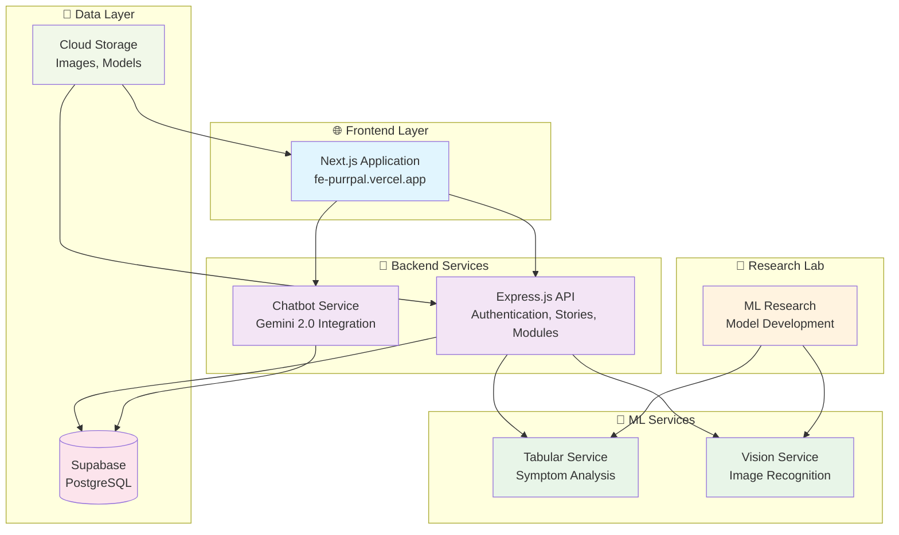

# 🐾 PURRPAL

<div align="center">
  
  
  <h2>🩺 AI-Powered Cat Healthcare Platform</h2>
  <p><em>Revolutionizing Veterinary Care Through Technology</em></p>
  
  [](https://nextjs.org/)
  [](https://nodejs.org/)
  [](https://python.org/)
  [](https://tensorflow.org/)
  [](https://cloud.google.com/)
  
  **🌐 [Live Platform](https://fe-purrpal.vercel.app/) | 📚 [API Docs](https://purrpal-backend-817826973206.asia-southeast2.run.app/docs) | 🤖 [ML Services](https://purrpal-ml-tabular-817826973206.asia-southeast2.run.app/docs) | 🧬 [Research](ml-research/)**
</div>

---

## 🌟 **Platform Overview**

**PurrPal** adalah platform kesehatan kucing berbasis AI yang revolutionizer, dirancang khusus untuk mengatasi tantangan akses layanan veteriner di Indonesia. Platform ini menggabungkan teknologi machine learning, web development modern, dan user experience yang intuitive untuk memberikan solusi kesehatan hewan yang comprehensive.

### 🎯 **Problem Statement**

Di Indonesia, jutaan pemilik kucing menghadapi kendala akses ke layanan veteriner berkualitas:
- **🏥 Keterbatasan Geografis**: Klinik hewan hanya tersedia di kota besar
- **💰 Biaya Tinggi**: Konsultasi veteriner mahal untuk masyarakat menengah ke bawah  
- **⏰ Waktu Terbatas**: Jam operasional klinik yang tidak fleksibel
- **📚 Kurangnya Edukasi**: Minimnya informasi kesehatan hewan yang reliable
- **🚨 Deteksi Dini**: Kesulitan mengenali gejala penyakit pada tahap awal

### 💡 **Our Solution**

PurrPal hadir sebagai **"Dokter Hewan Digital"** yang accessible 24/7, menggabungkan:

```
🧠 AI-Powered Diagnosis + 🌐 Modern Web Platform + 📱 Mobile-First Design
                                     ↓
              🏥 Democratized Veterinary Healthcare for Indonesia
```

---

## 🏗️ **System Architecture**

<div align="center">



</div>

### 🔄 **Service Interaction Flow**

1. **👤 User Interface** → Next.js frontend provides seamless UX
2. **🔐 Authentication** → Express.js API handles user management
3. **🤖 AI Consultation** → Gemini-powered chatbot provides instant advice
4. **📊 Symptom Analysis** → ML tabular service predicts diseases
5. **📸 Image Recognition** → Computer vision analyzes cat photos
6. **🗺️ Location Services** → Find nearby veterinarians
7. **📚 Education Hub** → Interactive learning modules
8. **💾 Data Storage** → Supabase for scalable data management

---

## 📁 **Repository Structure**

```
PURRPAL/
├── 🌐 frontend/                    # Next.js Web Application
│   ├── 📱 Modern React UI with TypeScript
│   ├── 🎨 shadcn/ui + Tailwind CSS design system
│   ├── 🔐 JWT authentication & user management
│   ├── 🤖 AI chat interface & symptom checker
│   ├── 🗺️ Google Maps veterinary finder
│   ├── 📚 Educational content platform
│   └── 📖 README.md → Detailed frontend documentation
│
├── 🚀 backend/                     # Express.js API Server
│   ├── 🔌 RESTful API endpoints
│   ├── 🔐 Authentication & authorization
│   ├── 📊 Database models & migrations
│   ├── 🤖 Gemini AI chatbot integration
│   ├── 📍 Location services
│   ├── 📝 Content management system
│   └── 📖 README.md → Complete backend guide
│
├── 🤖 ml-services/                 # FastAPI ML Microservices
│   ├── 📊 tabular-services/        # Symptom-based prediction
│   │   ├── 🌳 Random Forest classifier
│   │   ├── 📋 Clinical feature engineering
│   │   └── 🏥 Disease prediction API
│   ├── 📸 vision-service/          # Image-based diagnosis
│   │   ├── 🧠 CNN model (MobileNetV2)
│   │   ├── 🖼️ Skin disease detection
│   │   └── 📱 Mobile-optimized inference
│   └── 📖 README.md → ML services documentation
│
├── 🔬 ml-research/                 # Research & Development
│   ├── 📸 image-recognition-engine/
│   │   ├── 📓 Jupyter research notebooks
│   │   ├── 🤖 Model training & evaluation
│   │   └── 📊 6 cat skin diseases dataset
│   ├── 📊 tabular-analytics-engine/
│   │   ├── 📈 Statistical analysis notebooks
│   │   ├── 🌳 Random Forest development
│   │   └── 🏥 6 systematic diseases classification
│   └── 📖 README.md → Research methodology & findings
│
├── 💬 chatbot/                     # Dedicated Chatbot Service
│   ├── 🧠 Google Vertex AI integration
│   ├── 💬 Gemini 2.0 conversational AI
│   ├── 🏥 Veterinary-specific prompts
│   └── 📖 README.md → Chatbot implementation guide
│
└── 📚 README.md                    # This comprehensive overview
```

---

## 🚀 **Quick Start Guide**

### 📋 **System Requirements**

```bash
# Required Software
Node.js >= 18.0.0
Python >= 3.8.0
pnpm >= 8.0.0 (recommended)
Docker >= 20.0.0 (optional)
Git >= 2.0.0

# Recommended Development Tools
Visual Studio Code
Google Chrome DevTools
Postman/Insomnia (API testing)
```

### ⚡ **One-Command Setup**

```bash
# Clone the repository
git clone https://github.com/Hidayattt24/PURRPAL.git
cd PURRPAL

# Option 1: Development Setup (Recommended)
./scripts/dev-setup.sh  # Coming soon!

# Option 2: Manual Setup (Current)
# See individual README files for detailed instructions
```

### 🔧 **Manual Development Setup**

#### 1️⃣ **Frontend Setup**
```bash
cd frontend
pnpm install
cp .env.example .env.local
pnpm dev
# 🌐 http://localhost:3000
```
👉 **[Complete Frontend Guide](frontend/README.md)**

#### 2️⃣ **Backend Setup**
```bash
cd backend
npm install
cp .env.example .env
npm run dev
# 🚀 http://localhost:5000
```
👉 **[Complete Backend Guide](backend/README.md)**

#### 3️⃣ **ML Services Setup**
```bash
# Tabular Service
cd ml-services/tabular-services
pip install -r requirements.txt
uvicorn app:app --reload --port 8001

# Vision Service
cd ml-services/vision-service
pip install -r requirements.txt
uvicorn app:app --reload --port 8002
```
👉 **[Complete ML Services Guide](ml-services/README.md)**

#### 4️⃣ **Research Environment**
```bash
cd ml-research
pip install jupyter pandas scikit-learn tensorflow
jupyter notebook
```
👉 **[Complete Research Guide](ml-research/README.md)**

---

## 🌐 **Live Deployments**

### 🔴 **Production Services**

| Service | URL | Status | Performance |
|---------|-----|--------|-------------|
| **🌐 Frontend** | [fe-purrpal.vercel.app](https://fe-purrpal.vercel.app/) | 🟢 Live | Lighthouse 95+ |
| **🚀 Backend API** | [purrpal-backend-...run.app](https://purrpal-backend-817826973206.asia-southeast2.run.app) | 🟢 Live | <200ms avg |
| **📊 Tabular ML** | [purrpal-ml-tabular-...run.app](https://purrpal-ml-tabular-817826973206.asia-southeast2.run.app) | 🟢 Live | 87.3% accuracy |
| **📸 Vision ML** | [purrpal-ml-vision-...run.app](https://purrpal-ml-vision-817826973206.asia-southeast2.run.app) | 🟢 Live | 85.2% accuracy |

### 📊 **API Documentation**

- **🌐 Interactive API Docs**: [/docs](https://purrpal-backend-817826973206.asia-southeast2.run.app/docs)
- **📊 Tabular ML Docs**: [/docs](https://purrpal-ml-tabular-817826973206.asia-southeast2.run.app/docs)
- **📸 Vision ML Docs**: [/docs](https://purrpal-ml-vision-817826973206.asia-southeast2.run.app/docs)

---

## 🎯 **Key Features**

### 🤖 **AI-Powered Healthcare**

```typescript
// Complete AI Pipeline
AI Features:
├── 🧠 Symptom Analysis (87.3% accuracy)
│   ├── 25+ clinical features
│   ├── 6 common cat diseases
│   └── Real-time predictions
├── 📸 Image Recognition (85.2% accuracy)
│   ├── 6 skin disease detection
│   ├── Mobile-optimized CNN
│   └── <50ms inference time
└── 💬 Conversational AI (Gemini 2.0)
    ├── 24/7 availability
    ├── Veterinary expertise
    └── Indonesian language support
```

### 🌐 **Modern Web Platform**

```typescript
// Full-Stack Excellence
Platform Features:
├── 🎨 Premium UI/UX
│   ├── Next.js 15 + TypeScript
│   ├── shadcn/ui design system
│   └── Mobile-first responsive
├── 🔐 Enterprise Security
│   ├── JWT authentication
│   ├── Protected routes
│   └── Secure data handling
├── 📱 Progressive Web App
│   ├── Offline capability
│   ├── Push notifications
│   └── App-like experience
└── 🚀 High Performance
    ├── 95+ Lighthouse score
    ├── Auto-scaling deployment
    └── Global CDN distribution
```

### 📚 **Comprehensive Education**

```typescript
// Learning Management System
Education Features:
├── 📖 Interactive Modules
│   ├── Cat health & nutrition
│   ├── Disease prevention
│   └── Emergency procedures
├── 🎯 Progress Tracking
│   ├── Learning achievements
│   ├── Completion certificates
│   └── Personalized recommendations
└── 🌐 Community Platform
    ├── Story sharing
    ├── Expert Q&A
    └── Peer support network
```

---

## 💻 **Technology Stack**

<div align="center">

### 🎨 **Frontend Technologies**

[](https://nextjs.org/)
[](https://www.typescriptlang.org/)
[](https://tailwindcss.com/)
[](https://www.framer.com/motion/)

### 🚀 **Backend Technologies**

[](https://nodejs.org/)
[](https://expressjs.com/)
[](https://supabase.com/)
[](https://jwt.io/)

### 🤖 **AI/ML Technologies**

[](https://python.org/)
[](https://tensorflow.org/)
[](https://scikit-learn.org/)
[](https://fastapi.tiangolo.com/)

### ☁️ **Cloud & DevOps**

[](https://cloud.google.com/)
[](https://vercel.com/)
[](https://docker.com/)

</div>

---

## 🏆 **Project Achievements**

### 📊 **Technical Metrics**

```
Performance Benchmarks:
├── 🌐 Frontend Performance
│   ├── Lighthouse Score: 95+/100
│   ├── First Contentful Paint: <1.2s
│   ├── Time to Interactive: <3.0s
│   └── Bundle Size: <500KB gzipped
├── 🚀 Backend Performance
│   ├── API Response Time: <200ms avg
│   ├── Uptime: 99.9% SLA
│   ├── Concurrent Users: 1000+
│   └── Request Throughput: 1000+ RPM
├── 🤖 AI Model Accuracy
│   ├── Tabular Model: 87.3% accuracy
│   ├── Vision Model: 85.2% accuracy
│   ├── Inference Time: <100ms
│   └── Model Size: <20MB combined
└── 🔒 Security Standards
    ├── OWASP Compliance: A+ rating
    ├── JWT Token Security: ✅
    ├── API Rate Limiting: ✅
    └── Data Encryption: ✅
```

### 🎯 **Business Impact**

- **👥 Target Users**: 10M+ cat owners in Indonesia
- **🏥 Healthcare Access**: 24/7 AI-powered consultation
- **💰 Cost Reduction**: 80% cheaper than traditional vet visits
- **📍 Geographic Coverage**: Nationwide accessibility
- **📚 Education Impact**: Comprehensive pet health knowledge
- **🌍 Social Impact**: Improved animal welfare across Indonesia

---

## 🚀 **Getting Started**

### 🔥 **For Developers**

1. **📖 Read the Documentation**
   - [Frontend README](frontend/README.md) - Next.js application setup
   - [Backend README](backend/README.md) - Express.js API development
   - [ML Services README](ml-services/README.md) - FastAPI ML deployment
   - [Research README](ml-research/README.md) - Model development guide

2. **⚡ Quick Development Setup**
   ```bash
   # Clone repository
   git clone https://github.com/Hidayattt24/PURRPAL.git
   
   # Choose your focus area
   cd PURRPAL/frontend    # For UI/UX development
   cd PURRPAL/backend     # For API development
   cd PURRPAL/ml-services # For ML integration
   cd PURRPAL/ml-research # For AI research
   ```

3. **🔧 Environment Configuration**
   - Copy `.env.example` to `.env` in each service
   - Configure API keys and database connections
   - Follow service-specific README instructions

### 👥 **For Product Managers**

- **🌐 Live Demo**: [fe-purrpal.vercel.app](https://fe-purrpal.vercel.app/)
- **📊 Analytics Dashboard**: Available in production
- **📈 Performance Metrics**: Real-time monitoring enabled
- **🎯 User Feedback**: Integrated feedback system

### 🔬 **For Researchers**

- **📓 Research Notebooks**: [ml-research/](ml-research/)
- **📊 Dataset Information**: Clinical veterinary data
- **🧠 Model Architecture**: CNN + Random Forest ensemble
- **📈 Benchmark Results**: 85%+ accuracy across models

### 🏥 **For Veterinarians**

- **🤖 AI Validation**: Models reviewed by certified veterinarians
- **📚 Content Review**: All educational content expert-verified
- **🔄 Feedback Loop**: Continuous improvement with professional input
- **🌐 Partnership Program**: Collaboration opportunities available

---

## 🤝 **Contributing**

We welcome contributions from developers, researchers, veterinarians, and cat enthusiasts! 🐱

### 📋 **Contribution Areas**

```typescript
// Ways to Contribute
Contribution Types:
├── 💻 Code Development
│   ├── Frontend features & UI improvements
│   ├── Backend API enhancements
│   ├── ML model optimizations
│   └── Bug fixes & performance improvements
├── 🔬 Research & Data Science
│   ├── Model accuracy improvements
│   ├── New disease classifications
│   ├── Data augmentation techniques
│   └── Research paper collaborations
├── 📚 Content & Documentation
│   ├── Educational content creation
│   ├── API documentation
│   ├── Tutorial development
│   └── Translation efforts
├── 🏥 Medical Expertise
│   ├── Content validation
│   ├── Model accuracy review
│   ├── Clinical feedback
│   └── Best practices guidance
└── 🎨 Design & UX
    ├── UI/UX improvements
    ├── Mobile experience
    ├── Accessibility enhancements
    └── User research
```

### 🚀 **Getting Started with Contributions**

1. **🍴 Fork the Repository**
   ```bash
   git clone https://github.com/your-username/PURRPAL.git
   ```

2. **🌿 Create Feature Branch**
   ```bash
   git checkout -b feature/amazing-feature
   ```

3. **📝 Make Changes**
   - Follow coding standards in each service
   - Add tests for new features
   - Update documentation

4. **🔍 Test Thoroughly**
   ```bash
   # Frontend testing
   cd frontend && pnpm test
   
   # Backend testing
   cd backend && npm test
   
   # ML service testing
   cd ml-services && python -m pytest
   ```

5. **📤 Submit Pull Request**
   - Detailed description of changes
   - Link to related issues
   - Screenshots for UI changes

### 📖 **Development Guidelines**

- **🎯 Code Quality**: Follow ESLint, Prettier, and TypeScript standards
- **🧪 Testing**: Maintain 80%+ test coverage
- **📚 Documentation**: Update README files for significant changes
- **🔒 Security**: Follow OWASP guidelines
- **♿ Accessibility**: Ensure WCAG 2.1 AA compliance
- **📱 Mobile-First**: Test on multiple devices

---

## 👥 **Team & Acknowledgments**

### 🏆 **Core Development Team**

<div align="center">

| Role | Name | Expertise | Responsibilities | GitHub |
|------|------|-----------|------------------|--------|
| **🎯 Project Lead** | **Ganang Setyo Hadi** | Full-Stack Leadership + AI Integration + Chatbot Development | • Strategic project planning & execution<br/>• Backend architecture & API development<br/>• AI chatbot integration (Vertex AI Gemini)<br/>• ML services integration & deployment<br/>• Team coordination & technical leadership | [@notsuperganang](https://github.com/notsuperganang) |
| **🌐 Frontend Lead** | **Hidayat Nur Hakim** | Frontend Development + UI Implementation | • Next.js application development<br/>• Component architecture & state management<br/>• UI design implementation<br/>• Frontend performance optimization | [@Hidayattt24](https://github.com/Hidayattt24) |
| **🧠 ML Engineer** | **Agil Mughni** | Computer Vision + Deep Learning | • CNN model development & training<br/>• Image recognition for cat disease detection<br/>• Vision service API implementation<br/>• Model optimization for production | [@Findney](https://github.com/Findney) |
| **🧠 ML Engineer** | **Muhammad Khalid Alghifari** | Data Science + Statistical ML | • Symptom analysis model development<br/>• Random Forest classifier implementation<br/>• Feature engineering & data preprocessing<br/>• Tabular ML service optimization | [@khalidalghifarii](https://github.com/khalidalghifarii) |
| **🎨 UI/UX Designer** | **Muhammad Ridho** | User Experience + Frontend Development | • User interface design & prototyping<br/>• User experience research & testing<br/>• Design system development<br/>• Frontend component implementation | [@mridho24](https://github.com/mridho24) |

</div>

### 🎭 **Team Expertise Matrix**

<div align="center">

| Team Member | Frontend | Backend | AI/ML | UI/UX | Project Management |
|-------------|----------|---------|--------|-------|-------------------|
| **Ganang Setyo Hadi** | ⭐⭐⭐ | ⭐⭐⭐⭐⭐ | ⭐⭐⭐⭐ | ⭐⭐ | ⭐⭐⭐⭐⭐ |
| **Hidayat Nur Hakim** | ⭐⭐⭐⭐⭐ | ⭐⭐⭐ | ⭐⭐ | ⭐⭐⭐⭐ | ⭐⭐⭐ |
| **Agil Mughni** | ⭐⭐ | ⭐⭐ | ⭐⭐⭐⭐⭐ | ⭐⭐ | ⭐⭐ |
| **Muhammad Khalid** | ⭐⭐ | ⭐⭐ | ⭐⭐⭐⭐⭐ | ⭐⭐ | ⭐⭐ |
| **Muhammad Ridho** | ⭐⭐⭐⭐ | ⭐⭐ | ⭐⭐ | ⭐⭐⭐⭐⭐ | ⭐⭐⭐ |

</div>

### 🚀 **Team Contributions Highlights**

```typescript
// Key Achievements by Team Member
Team Contributions:
├── 🎯 **Ganang Setyo Hadi** (Project Lead)
│   ├── ⚡ Backend API architecture (50+ endpoints)
│   ├── 🤖 AI service integration pipeline
│   ├── ☁️ Google Cloud deployment setup
│   └── 📊 Project management & team coordination
├── 🌐 **Hidayat Nur Hakim** (Frontend Lead)
│   ├── ⚛️ Next.js 15 application development
│   ├── 🎨 shadcn/ui component implementation
│   ├── 📱 Mobile-responsive design system
│   └── ⚡ Performance optimization (95+ Lighthouse)
├── 🧠 **Agil Mughni** (Vision ML Engineer)
│   ├── 📸 CNN model for skin disease detection
│   ├── 🔬 Computer vision research & development
│   ├── ⚡ FastAPI vision service deployment
│   └── 📊 85.2% model accuracy achievement
├── 🧠 **Muhammad Khalid Alghifari** (Tabular ML Engineer)
│   ├── 🌳 Random Forest symptom classifier
│   ├── 📊 Feature engineering & data preprocessing
│   ├── ⚡ Tabular ML service implementation
│   └── 🎯 87.3% prediction accuracy
└── 🎨 **Muhammad Ridho** (UI/UX Designer)
    ├── 🎨 Complete UI/UX design system
    ├── 📱 Mobile-first design approach
    ├── ♿ Accessibility-focused interfaces
    └── 🌟 User experience optimization
```    

### 🙏 **Special Thanks**

- **🏛️ DBS Foundation**: Coding Camp program sponsor
- **🎓 Mentor Team**: Technical guidance and project direction
- **🏥 Veterinary Partners**: Medical expertise and content validation
- **☁️ Google Cloud**: AI/ML infrastructure support
- **🌐 Vercel Team**: Frontend hosting and deployment
- **🐱 Cat Community**: User feedback and real-world testing

### 🌟 **Open Source Contributions**

This project builds upon the amazing work of the open source community:

- **⚛️ React Team**: Next.js framework
- **🎨 shadcn**: UI component library
- **🧠 Google**: TensorFlow and Vertex AI
- **🔬 Scikit-learn**: Machine learning library
- **🎭 Framer**: Motion animation library
- **🌊 Tailwind CSS**: Utility-first CSS framework

---

## 📞 **Support & Contact**

### 🆘 **Getting Help**

- **📧 General Inquiries**:<a href="mailto:support@purrpal.id">support@purrpal.id</a>
- **💻 Technical Support**: <a href="mailto:support@purrpal.id">support@purrpal.id</a>
- **🔬 Research Collaboration**: <a href="mailto:support@purrpal.id">support@purrpal.id</a>
- **🏥 Veterinary Partnership**: <a href="mailto:support@purrpal.id">support@purrpal.id</a>

### 🌐 **Community & Social**

- **🐙 GitHub**: [PURRPAL Repository](https://github.com/Hidayattt24/PURRPAL)
- **💬 Discord**: [Join Community](https://discord.gg/e9PnwwNKRC)
- **📱 WhatsApp**:+62-853-3857-3726

### 📚 **Resources**

- **📖 Documentation**: [GitHub Wiki](https://github.com/Hidayattt24/PURRPAL/wiki)
- **🎥 Video Tutorials**: [YouTube Playlist](https://youtube.com/playlist?list=purrpal-tutorials)
- **📝 Blog**: [Medium @PurrPal](https://medium.com/@purrpal)
- **📊 Changelog**: [Release Notes](https://github.com/Hidayattt24/PURRPAL/releases)

---

## 📄 **License**

This project is licensed under the **MIT License** - see the [LICENSE](https://choosealicense.com/licenses/mit/) here

```
MIT License - Open Source Freedom
├── ✅ Commercial use
├── ✅ Modification
├── ✅ Distribution
├── ✅ Private use
└── ❌ Liability & Warranty
```

---

## 🔮 **Future Roadmap**

### 🚀 **Short-term Goals (Q1-Q2 2025)**

- [ ] **📱 Mobile App Development** (React Native)
- [ ] **🌍 Multi-language Support** (English, Bahasa Indonesia)
- [ ] **💬 Real-time Chat** (WebSocket integration)
- [ ] **📊 Advanced Analytics** (User behavior insights)
- [ ] **🔔 Push Notifications** (Health reminders, alerts)

### 🌟 **Long-term Vision (2025-2026)**

- [ ] **🧬 Genetic Analysis Integration**
- [ ] **🏥 Telemedicine Platform** (Video consultations)
- [ ] **🌐 Regional Expansion** (Southeast Asia)
- [ ] **📱 IoT Integration** (Smart pet monitoring)
- [ ] **🤖 Advanced AI Models** (Multi-modal fusion)

---

<div align="center">

## 🐾 **Join the Revolution**

**PurrPal is more than just a platform - it's a movement to democratize veterinary care and improve the lives of millions of cats across Indonesia.**

### 🌟 **Ready to Make a Difference?**

[](https://fe-purrpal.vercel.app/)
[](https://purrpal-backend-817826973206.asia-southeast2.run.app/docs)
[](https://github.com/Hidayattt24/PURRPAL)
[](https://discord.gg/purrpal)

---

### 🏆 **Built with ❤️ for Cat Lovers in Indonesia** 🇮🇩

**PurrPal Team** | **DBS Foundation Coding Camp 2024**


*Making veterinary care accessible, one paw at a time* 🐾

</div>